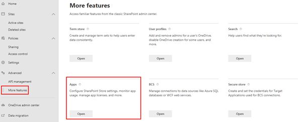

# Create & Configure your SharePoint Online Developer Tenant

In this demo you will configure your SharePoint environment to be ready for SharePoint Framework development. This process involves three steps: creating an app catalog site for your tenant, a developer site collection and a site collection app catalog in your developer site collection.

### Create an app catalog for your SharePoint tenant

1. Open a browser and navigate to your Office 365 tenant's **SharePoint Admin Center** site: **https://{{REPLACE_WITH_YOUR_TENANTID}}-admin.sharepoint.com/_layouts/15/online/AdminHome.aspx**.

    > Replace the text `{{REPLACE_WITH_YOUR_TENANTID}}` in the above URL with the unique prefix for your Office 365 tenant.

1. Select **Classic features** in the left-hand navigation.

    

1. Select the **Open** button under **Apps**.

    

1. When the new page opens, select **App Catalog**.

    

    > If you are taken to an app catalog site as shown in the following image, then your tenant already has an app catalog, created by someone previously. In this case, you can skip to the next step to create a developer site collection.
    >
    > 
    >
    > Otherwise, if you are presented with a form to create an app catalog (*as shown in the following image*), your tenant does not already have an app catalog. In this case, continue with the following steps to create an app catalog.
    >
    > 

1. Select **Create a new app catalog site** option & select the **OK** button.
1. On the **Create App Catalog Site Collection** page, enter the following details and select **OK**:
    - **Title**: app catalog
    - **Web Site Address (suffix)**: appcatalog
    - **Administrator**: *enter your username & select the **check names** icon to resolve your username*

    

    SharePoint Online will provision the app catalog for the tenant.

### Create a developer site collection

1. Open a browser and navigate to your Office 365 tenant's **SharePoint Admin Center** site: **https://{{REPLACE_WITH_YOUR_TENANTID}}-admin.sharepoint.com/_layouts/15/online/AdminHome.aspx**.

    > Replace the text `{{REPLACE_WITH_YOUR_TENANTID}}` in the above URL with the unique prefix for your Office 365 tenant.

1. On the **SharePoint Admin Center** site, select **Sites > Active sites** from the left-hand navigation and then select **Create**.

    

1. On the **Create a site** panel, select the **Other options** button.

    
    
1. On the **Other options** panel, open the **Choose a template** dropdown and select **More templates**. This will open the **Create Site Collection** page in a new browser tab.

    
    
1. In the **Create Site Collection** page, enter the following values to create a new developer site collection and select **OK**.

    - **Title**: Developer Site
    - **Web Site Address (suffix)**: /dev
    - **Template Selection**: Collaboration / Developer Site
    - **Administrator**: *enter your username & select the **check names** icon to resolve your username*

    

> NOTE: After a few minutes the site collection will be created. Navigate back to the **SharePoint Admin Center** using the URL provided above and then select the **Sites > Active Sites** item in the left-hand navigation. You will see a list of all *classic* and *modern* sites including the **Developer site** that you just created.
>
> 
