# Getting Started with the SharePoint Framework

In this lab you work with the SharePoint Framework as an end user and then get your local & online environment configured for developing with the SharePoint Framework.

## In this lab

- [Create & Configure your SharePoint Online Developer Tenant](#exercise1)
- [Setup your local SPFx Developer Environment](#exercise2)
- [Interact with SPFx Client-Side Web Parts in Modern Sites](#exercise3)

## Prerequisites

To complete this lab, you need the following:

- Office 365 tenancy

  > If you do not have one, you obtain one (for free) by signing up to the [Office 365 Developer Program](https://developer.microsoft.com/office/dev-program).

<a name="exercise1"></a>

## Exercise 1: Create & Configure your SharePoint Online Developer Tenant

In this exercise you will configure your SharePoint environment to be ready for SharePoint Framework development. This process involves three steps: creating an app catalog site for your tenant, a developer site collection and a site collection app catalog in your developer site collection.

### Create app catalog for your SharePoint tenant

1. Open a browser and navigate to your Office 365 tenant's **SharePoint Admin Center** site: **https://{{REPLACE_WITH_YOUR_TENANTID}}-admin.sharepoint.com**

    > Replace the text `{{REPLACE_WITH_YOUR_TENANTID}}` in the above URL with the unique prefix for your Office 365 tenant.

1. If you are taken to the new admin center (also known as the modern admin center) you will need to click the **Classic SharePoint admin center** link in the left-hand navigation.

    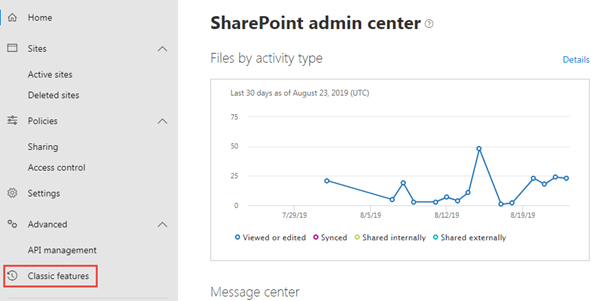

1. In the left-hand navigation, select **apps**.
1. When the page refreshes, select **app catalog**.

    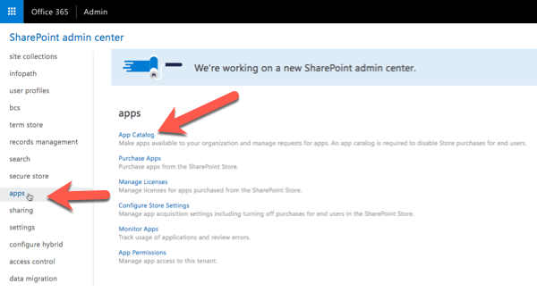

    > If you are taken to an app catalog site as shown in the following image, then your tenant already has an app catalog, created by someone previously. SharePoint Online tenancies can only have one app catalog. In this case, you can skip to the next step to create a developer site collection.
    >
    > 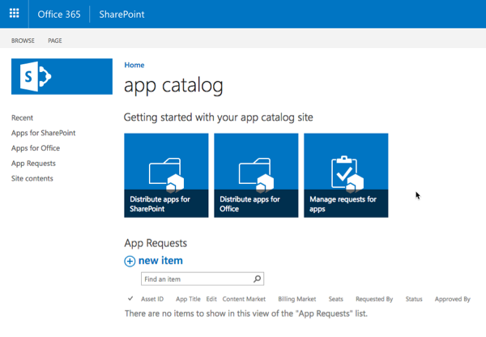
    >
    > Otherwise, if you are presented with a form to create an app catalog (*as shown in the following image*), your tenant does not already have an app catalog. In this case, continue with the following steps to create an app catalog.
    >
    > 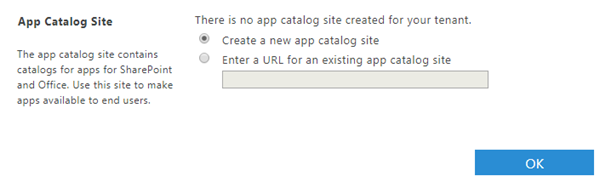

1. Select **Create a new app catalog site** option & select the **OK** button.
1. On the **Create App Catalog Site Collection** page, enter the following details and select **OK**:
    - **Title**: app catalog
    - **Web Site Address (suffix)**: appcatalog
    - **Administrator**: *enter your username & select the **check names** icon to resolve your username*

    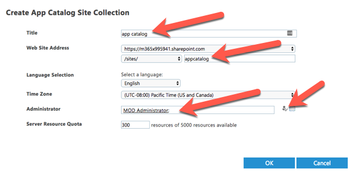

    SharePoint Online will provision the app catalog for the tenant.

### Create a developer site collection

1. Open a browser and navigate to your Office 365 tenant's **SharePoint Admin Center** site: **https://{{REPLACE_WITH_YOUR_TENANTID}}-admin.sharepoint.com**

    > Replace the text `{{REPLACE_WITH_YOUR_TENANTID}}` in the above URL with the unique prefix for your Office 365 tenant.

1. On the **SharePoint Admin Center** site, select **New > Private Site Collection** from the ribbon menu:

    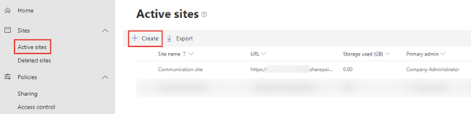

1. In the **New Site Collection** dialog, enter the following values to create a new developer site collection and select **OK**:

    - **Title**: Developer Site
    - **Web Site Address (suffix)**: /dev
    - **Template Selection**: Collaboration / Developer Site
    - **Administrator**: *enter your username & select the **check names** icon to resolve your username*

    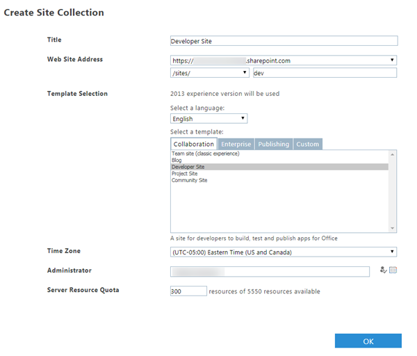

> NOTE: After a few minutes the site collection will be created. The default SharePoint Admin Center currently only displays *classic* SharePoint site collections. On this page there will be a banner to preview the **new SharePoint admin center**. Select **Try the preview** to try the new admin center.
>
> In the new **SharePoint Admin Center**, select the **Sites > Active Sites** item in the left-hand menu to see a list of all sites, including *classic* as well as *modern* sites. In this list, you will see the **Developer site** that you just created:
>
> 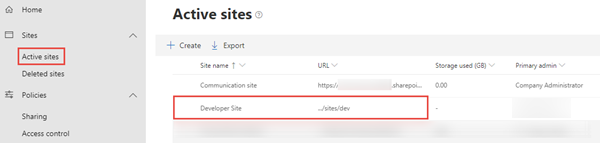

<a name="exercise2"></a>

## Exercise 2: Setup your local SPFx Developer Environment

In this exercise you will setup your local developer environment with everything you need start creating SharePoint Framework components.

### Install a Code Editor

You will need a text editor to edit your code files. There are no requirements for what you need in a text editor.

The remainder of this lab & most examples you find from Microsoft use [Visual Studio Code](https://code.visualstudio.com/).

### Install Node.js

The tools used in compiling, debugging and packaging SharePoint Framework projects are built using Node.js, a runtime that enables JavaScript to run locally vs. a browser. Therefore the first step is to install the runtime, Node.js, before installing the required tools.

> Node.js is available in two different releases: the long term support release (aka: LTS) is the most stable version that is recommended for most users while the current version contains the latest features.
> Before installing Node.js, you should verify you haven't previously installed it as part of another install. Open a command prompt or terminal (depending on your developer platform) and execute the following command:
>
> ```shell
> node -v
> ```
>
> If a version number is returned, you already have Node. The SharePoint Framework build toolchain is tested and supported against the 8.x and 10.x LTS versions. So, if you have version 10.x you do not need to download and install a newer version. If you have version 9.x you should install the current LTS version. If you have version 8.x you have the option to keep the current version or install the current LTS version. Finally, if you have  version 7.x or earlier you should install the current LTS version.

If you do not need to install the current LTS version of Node then skip to the next section.

1. Open a browser and navigate to the Node.js Foundation site: https://www.nodejs.org.

1. Select **Downloads** from the top menu navigation.

1. Select LTS and then select the installer for your developer environment. Both Windows and macOS installers are available. This page contains options for additional installs as well such as SunOS, Linux, AIX and even source code downloads.

    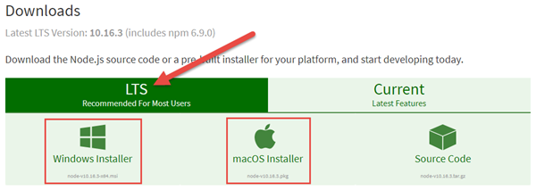

1. Run the installer to install Node.js and the included version of NPM (*a package manager that Node.js uses, similar to .NET's NuGet*).

### Install Required Tools

The SharePoint Framework development experience utilizes a set of tools built on Node.js that are popular among web developers. These tools are built on Node.js which means they can be used on any platform and will work the same way. This includes Windows, macOS and Linux.

1. Install Yeoman - http://yeoman.io

    Yeoman is a scaffolding engine which executes *generators* that prompt the user with questions. Based on the answers to these questions, Yeoman then creates the folders and files defined by the generator.

      1. Open a command prompt / terminal window and execute the following command to install Yeoman globally with NPM:

          ```shell
          npm install --global yo
          ```

1. Install the SharePoint Framework Yeoman generator.

    Microsoft has created a Yeoman generator for scaffolding SharePoint Framework projects.

      1. Open a command prompt / terminal window and execute the following command to install the SharePoint Framework Yeoman generator globally with NPM:

          ```shell
          npm install --global @microsoft/generator-sharepoint
          ```

1. Install Gulp - https://gulpjs.com

    Gulp is a task runner utility. It's similar to MSBuild, a tool used by .NET developers and Visual Studio to compile projects, package solutions into redistributes and start a debugging experience.

      1. Open a command prompt / terminal window and execute the following command to install Gulp globally with NPM:

          ```shell
          npm install --global gulp
          ```

<a name="exercise3"></a>

## Exercise 3: Interact with SPFx Client-Side Web Parts in Modern Sites

In this exercise you will add and interact with SharePoint Framework based client-side web parts in a SharePoint Online modern site collection.

> NOTE: The instructions below assume you are using v1.8.2 of the SharePoint Framework Yeoman generator. 

1. Open a browser and navigate a modern site in SharePoint Online that you have access to

    If prompted, login using your Work or School credentials.
1. Create a new modern page to use in this exercise:

  1. Select the **Pages** link in the left-hand Quick Launch navigation menu

      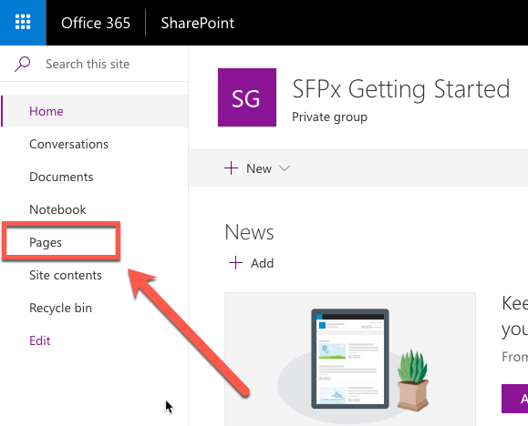

1. In the **Pages** library, select the **New** button from the toolbar and select **Site Page** to create a new page.

    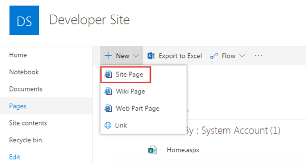

1. With the page in edit mode, select the web part icon button to open the list of available web parts:

    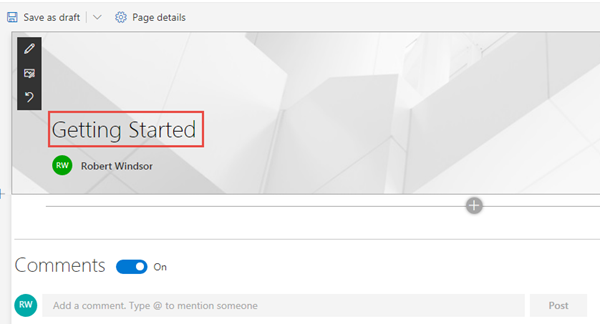

1. Select the web part **Text**.
1. When the web part is added to the page, add some text and use the rich-text formatting tools provided in the toolbar:

    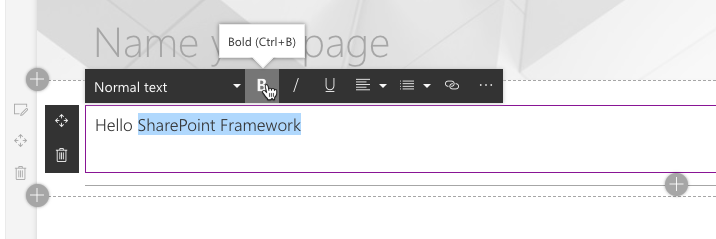

1. Delete the web part form the page by selecting the trash can icon to the left of the web part:

    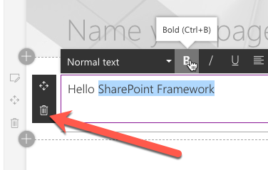

### Verify your Developer Environment is Configured

Use the tools installed in exercise 2 to create a new SharePoint Framework component and test it in the local developer environment.

1. Open a command prompt and change to the folder where you want to create the project.
1. Run the SharePoint Yeoman generator by executing the following command:

    ```shell
    yo @microsoft/sharepoint
    ```

    Use the following to complete the prompt that is displayed:

    * **What is your solution name?**: HelloWorld
    * **Which baseline packages do you want to target for your component(s)?**: SharePoint Online only (latest)
    * **Where do you want to place the files?**: Use the current folder
    * **Do you want to allow the tenant admin the choice of being able to deploy the solution to all sites immediately without running any feature deployment or adding apps in sites?**: No
    * **Will the components in the solution require permissions to access web APIs that are unique and not shared with other components in the tenant?**: No    
    * **Which type of client-side component to create?**: WebPart
    * **What is your Web part name?**: HelloWorld
    * **What is your Web part description?**: HelloWorld description
    * **Which framework would you like to use?**: No JavaScript framework

    After provisioning the folders required for the project, the generator will install all the dependency packages using NPM.

1. When NPM completes downloading all dependencies, run the project by executing the following command:

    ```shell
    gulp serve
    ```

1. The SharePoint Framework's gulp **serve** task will build the project, start a local web server and launch a browser open to the SharePoint Workbench:

    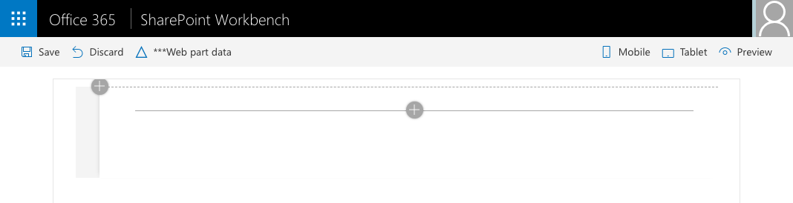

1. Select the web part icon button to open the list of available web parts:

    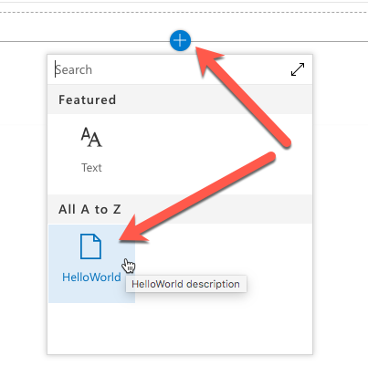

1. Select the **HelloWorld** web part:

    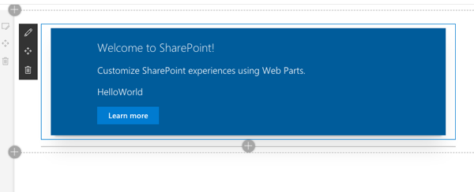

1. Edit the web part's properties by selecting the pencil (edit) icon in the toolbar to the left of the web part:

    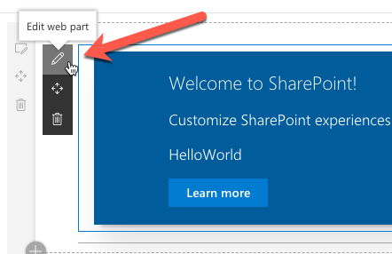

1. In the property pane that opens, change the value of the **Description Field**. Notice how the web part updates as you make changes to the text:

    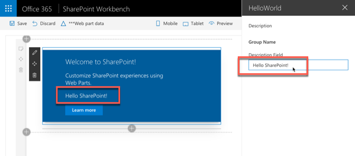

1. Close the browser and stop the local web server by pressing <kbd>CTRL</kbd>+<kbd>C</kbd> in the command prompt.