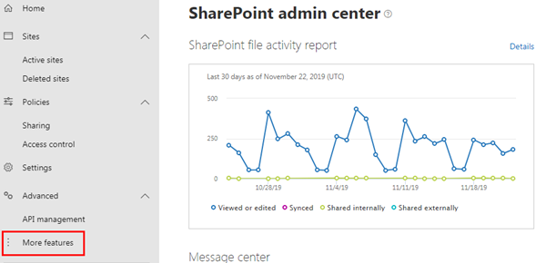
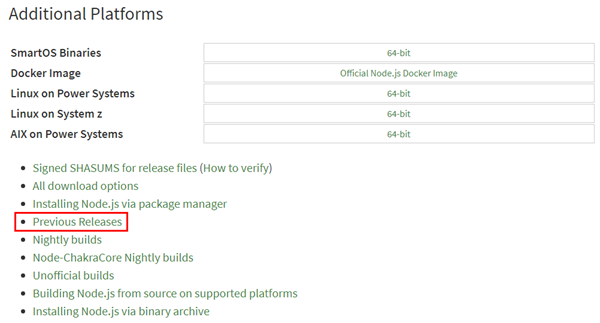
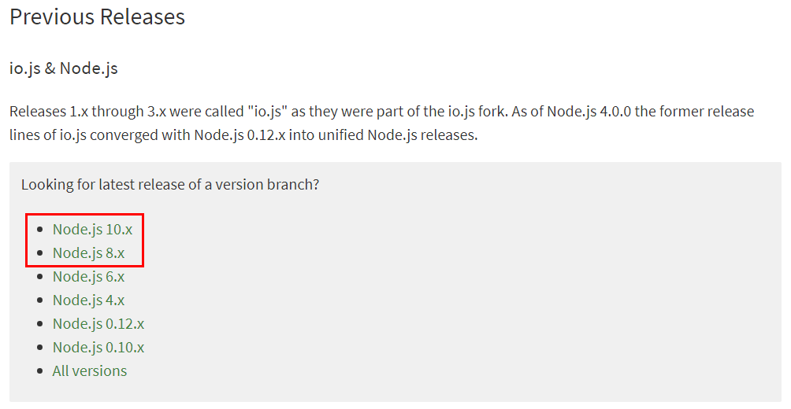

# Getting Started with the SharePoint Framework

In this lab you work with the SharePoint Framework as an end user and then get your local & online environment configured for developing with the SharePoint Framework.

## In this lab

- [Create & Configure your SharePoint Online Developer Tenant](#exercise1)
- [Setup your local SPFx Developer Environment](#exercise2)
- [Interact with SPFx Client-Side Web Parts in Modern Sites](#exercise3)

## Prerequisites

To complete this lab, you need the following:

- Office 365 tenancy

  > If you do not have one, you obtain one (for free) by signing up to the [Office 365 Developer Program](https://developer.microsoft.com/office/dev-program).

<a name="exercise1"></a>

## Exercise 1: Create & Configure your SharePoint Online Developer Tenant

In this exercise you will configure your SharePoint environment to be ready for SharePoint Framework development. 

### Create an app catalog for your SharePoint tenant

1. Open a browser and navigate to your Office 365 tenant's **SharePoint Admin Center** site: **https://{{REPLACE_WITH_YOUR_TENANTID}}-admin.sharepoint.com/_layouts/15/online/AdminHome.aspx**.

    > Replace the text `{{REPLACE_WITH_YOUR_TENANTID}}` in the above URL with the unique prefix for your Office 365 tenant.

1. Select **More features** in the left-hand navigation.

    

1. Select the **Open** button under **Apps**.

    

1. When the new page opens, select **App Catalog**.

    

    > If you are taken to an app catalog site as shown in the following image, then your tenant already has an app catalog, created by someone previously. In this case, you can skip to the next step to create a developer site collection.
    >
    > 
    >
    > Otherwise, if you are presented with a form to create an app catalog (*as shown in the following image*), your tenant does not already have an app catalog. In this case, continue with the following steps to create an app catalog.
    >
    > 

1. Select **Create a new app catalog site** option & select the **OK** button.
1. On the **Create App Catalog Site Collection** page, enter the following details and select **OK**.
    - **Title**: app catalog
    - **Web Site Address (suffix)**: appcatalog
    - **Administrator**: *enter your username & select the **check names** icon to resolve your username*

    

    SharePoint Online will provision the app catalog for the tenant.

### Create a development site collection

1. Open a browser and navigate to your Office 365 tenant's **SharePoint Admin Center** site: **https://{{REPLACE_WITH_YOUR_TENANTID}}-admin.sharepoint.com/_layouts/15/online/AdminHome.aspx**.

    > Replace the text `{{REPLACE_WITH_YOUR_TENANTID}}` in the above URL with the unique prefix for your Office 365 tenant.

1. On the **SharePoint Admin Center** site, select **Sites > Active sites** from the left-hand navigation and then select **Create**.

    

1. On the **Create a site** panel, select the **Other options** button.

    
    
1. On the **Other options** panel, keep the default value of **Team site** in the **Choose a template** dropdown and then enter the following values to create a new team site collection and select **Finish**.

    - **Site name**: Developer Site
    - **Site address**: ../sites/DeveloperSite
    - **Primary administrator**: *use the people picker to select your account*
    - **Select a language**: English

    

> NOTE: After a minute or two the site collection will be created. On the **SharePoint Admin Center** site, select the **Sites > Active Sites** item in the left-hand navigation. You will see a list of all *classic* and *modern* sites including the **Developer site** that you just created.
>
> 

<a name="exercise2"></a>

## Exercise 2: Setup your local SPFx Developer Environment

In this exercise you will setup your local developer environment with everything you need start creating SharePoint Framework components.

### Install a Code Editor

You will need a text editor to edit your code files. There are no requirements for what you need in a text editor.

The remainder of this lab and most of the examples you'll find from Microsoft use [Visual Studio Code](https://code.visualstudio.com/).

### Install Node.js

The tools used in compiling, debugging, and packaging SharePoint Framework projects are built using Node.js, a runtime that enables JavaScript to run locally versus in a browser. Therefore the first step is to install the runtime, Node.js, before installing the required tools.

> Node.js is available in two different releases: the long term support release (aka: LTS) is the most stable version that is recommended for most users while the current version contains the latest features.
> Before installing Node.js, you should verify you haven't installed it previously. Open a command prompt or terminal (depending on your developer platform) and execute the following command:
>
> ```shell
> node -v
> ```
>
> If a version number is returned, you already have Node.js. The version(s) of Node.js you may use depends on the environment(s) you will be targeting. If you will be targeting SharePoint Server 2016, you must use Node.js version 8.x. If you will be targeting SharePoint Server 2019 and/or SharePoint Online, then you can use either Node.js version 8.x or Node.js version 10.x. 

If you already have a version of Node.js that is compatible with the environment(s) you will be targeting, then skip to the next section.

1. Open a browser and navigate to the Node.js Foundation site: https://www.nodejs.org.

    Note that the LTS version is currently 12.x so you will need to navigate further into the site to find the appropriate installer.

1. Select **Downloads** from the top menu navigation then scroll to the bottom of the page and select **Previous Releases**.

    

1. In the Previous Releases page, select Node.js 8.x if you will be targeting SharePoint Server 2016 or Node.js 10.x if you will be targeting SharePoint Server 2019 and/or SharePoint Online.

    

1. Download the appropriate installer or binary for the platorm you are using.

    

1. Run the installer, accepting all the default options. This will install Node.js and NPM (*a package manager that Node.js uses, similar to .NET's NuGet*).

### Install Required Tools

The SharePoint Framework development experience utilizes a set of tools built on Node.js that are popular among web developers. These tools are built on Node.js which means they can be used on any platform and will work the same way. This includes Windows, macOS and Linux.

1. Install Yeoman - http://yeoman.io

    Yeoman is a scaffolding engine which executes *generators* that prompt the user with questions. Based on the answers to these questions, Yeoman then creates the folders and files defined by the generator.

      1. Open a command prompt / terminal window and execute the following command to install Yeoman globally with NPM:

          ```shell
          npm install --global yo
          ```

1. Install the SharePoint Framework Yeoman generator.

    Microsoft has created a Yeoman generator for scaffolding SharePoint Framework projects.

      1. Open a command prompt / terminal window and execute the following command to install the SharePoint Framework Yeoman generator globally with NPM:

          ```shell
          npm install --global @microsoft/generator-sharepoint
          ```

1. Install Gulp - https://gulpjs.com

    Gulp is a task runner utility. It's similar to MSBuild, a tool used by .NET developers and Visual Studio to compile projects, package solutions into redistributes and start a debugging experience.

      1. Open a command prompt / terminal window and execute the following command to install Gulp globally with NPM:

          ```shell
          npm install --global gulp
          ```

<a name="exercise3"></a>

## Exercise 3: Interact with SPFx Client-Side Web Parts in Modern Sites

In this exercise you will add and interact with SharePoint Framework based client-side web parts in a SharePoint Online modern site collection.

1. Open a browser and navigate to the development site you created in the first exercise. If prompted, login using your Work or School credentials.

1. Select the **Pages** link in the left-hand Quick Launch navigation menu.

    

1. In the **Pages** library, select the **New** button from the toolbar and select **Site Page** to create a new page.

    

1. Set the name of the page to **Getting Started**.

    

1. Select the web part icon button to open the list of available web parts.

    

1. Select the web part **Text**.

    

1. When the web part is added to the page, add some text and use the rich-text formatting tools provided in the toolbar.

    

1. Click **Save as draft** to see the page as your users will see it.

    

    

### Verify your Developer Environment is Configured

> NOTE: The instructions below assume you are using v1.9.1 of the SharePoint Framework Yeoman generator. 

Use the tools installed in exercise 2 to create a new SharePoint Framework component and test it in the local developer environment.

1. Open a command prompt and change to an empty folder where you want to store the files for the project.
1. Run the SharePoint Yeoman generator by executing the following command:

    ```shell
    yo @microsoft/sharepoint
    ```

    Use the following to complete the prompt that is displayed:

    * **What is your solution name?**: HelloWorld
    * **Which baseline packages do you want to target for your component(s)?**: SharePoint Online only (latest)
    * **Where do you want to place the files?**: Use the current folder
    * **Do you want to allow the tenant admin the choice of being able to deploy the solution to all sites immediately without running any feature deployment or adding apps in sites?**: No
    * **Will the components in the solution require permissions to access web APIs that are unique and not shared with other components in the tenant?**: No    
    * **Which type of client-side component to create?**: WebPart
    * **What is your Web part name?**: HelloWorld
    * **What is your Web part description?**: HelloWorld description
    * **Which framework would you like to use?**: No JavaScript framework

    After provisioning the folders required for the project, the generator will install all the dependency packages using NPM.

1. When NPM completes downloading all dependencies, install the developer certificate by executing the following command:

    ```shell
    gulp trust-dev-cert
    ```

1. Run the project by executing the following command:

    ```shell
    gulp serve
    ```

1. The SharePoint Framework's gulp **serve** task will build the project, start a local web server and launch a browser open to the SharePoint Workbench.

    

1. Select the web part icon button to open the list of available web parts.

    

1. Select the **HelloWorld** web part.

    

1. Edit the web part's properties by selecting the pencil (edit) icon in the toolbar to the left of the web part.

    

1. In the property pane that opens, change the value of the **Description Field**. Notice how the web part updates as you make changes to the text.

    

1. Close the browser and stop the local web server by pressing <kbd>CTRL</kbd>+<kbd>C</kbd> in the command prompt.